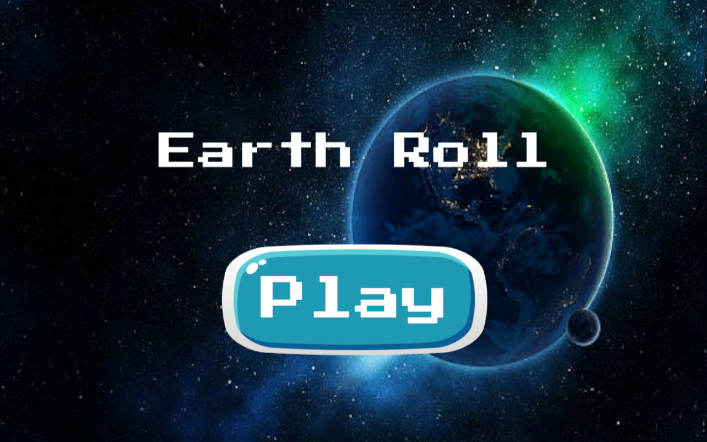
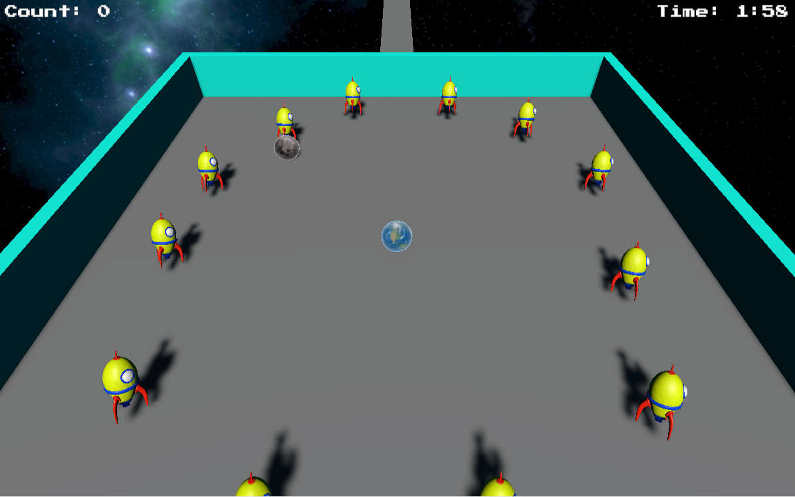

# Roll-Earth
A Unity project based on the tutorial [Roll-a-Ball](https://learn.unity.com/project/roll-a-ball?uv=2022.3), with additional features added to enhance gameplay and environmental immersion.

In control of planet Earth using the 'A', 'W', 'S', 'D' keys, you must collect rockets as you roll through the vast and mysterious outer space. The vastness of the cosmos unfolds around you, with sparkling stars and distant nebulae, as you navigate through this stunning environment.

Be wary of meteors, as an impact could result in the destruction of humanity, much like it did with the dinosaurs. Manage your time skillfully, as danger looms closer with each passing second.

Furthermore, careful movement between bases presents another challenge. Keep your fingers steady and precise to prevent our home from being lost in the infinite cold and dark space.

The main objective is to provide fun, so enjoy yourself and good luck!

Click here to play [Roll-Earth](https://adneycm.itch.io/roll-earth-adneycm)

### Unity Assets:
https://assetstore.unity.com/packages/3d/environments/planets-of-the-solar-system-3d-90219

https://assetstore.unity.com/packages/3d/environments/sci-fi/asteroids-low-poly-pack-142164

https://assetstore.unity.com/packages/2d/textures-materials/sky/nebula-skyboxes-219924

https://assetstore.unity.com/packages/3d/vehicles/space/atom-rocket-model-140021

### References:

- [Moving object in the scene](https://www.youtube.com/watch?v=32JkMANaMpk)
- [Music and Sound effects](https://www.youtube.com/watch?v=N8whM1GjH4w&t=437s)
- [Countdown timer](https://www.youtube.com/watch?v=POq1i8FyRyQ&t=185s)
- [Main Menu](https://www.youtube.com/watch?v=DX7HyN7oJjE&t=128s)
